# KBoard

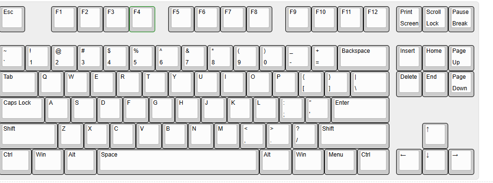

## Overview
a 75%% keyboard design, it is based on RP2040 plus with a type C port which came in-built with the MCU, there total of 87 MX switches with 5 Stabilizers. A complete keyboard :).

## Bit in depth info
The keyboard is designed to be sleek and plane it has RP2040 plus as the MCU and Cherry MX Brown Switches for the keys which are used for versatile purposes (that's what i saw at least). The main firmware is KMK based and the Firmware has already been released, you can find that in the Firmware and Production folder, I hate using different cables so having type c inbuilt in the RP2040 plus is a win-win.

---

## Files to build 

### PCB 

The files for the PCB and Schematics are available in the Kicad folder and gerber files are added in the Production folder..

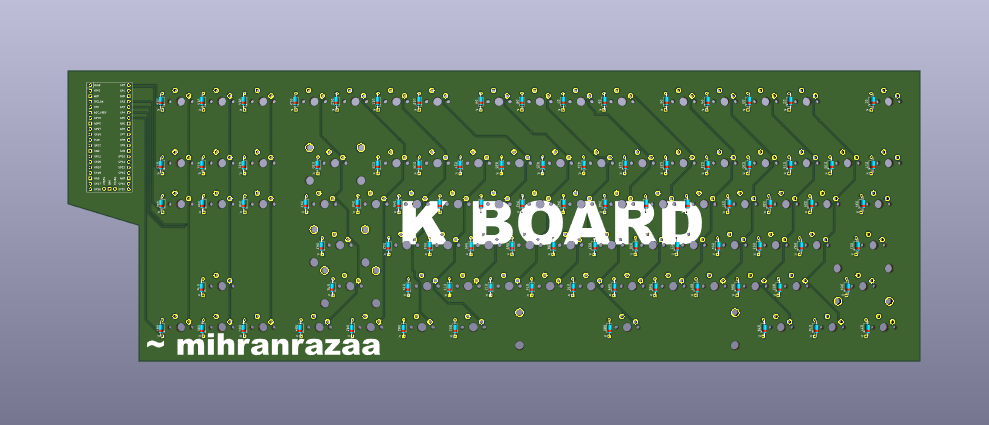

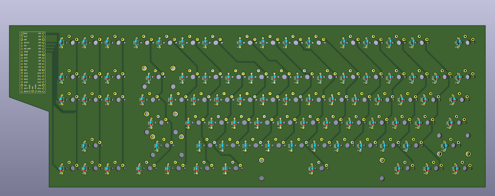

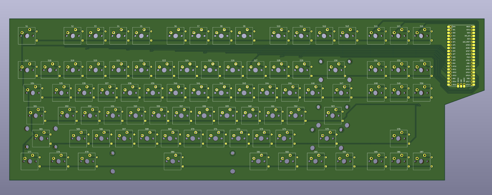

## Images

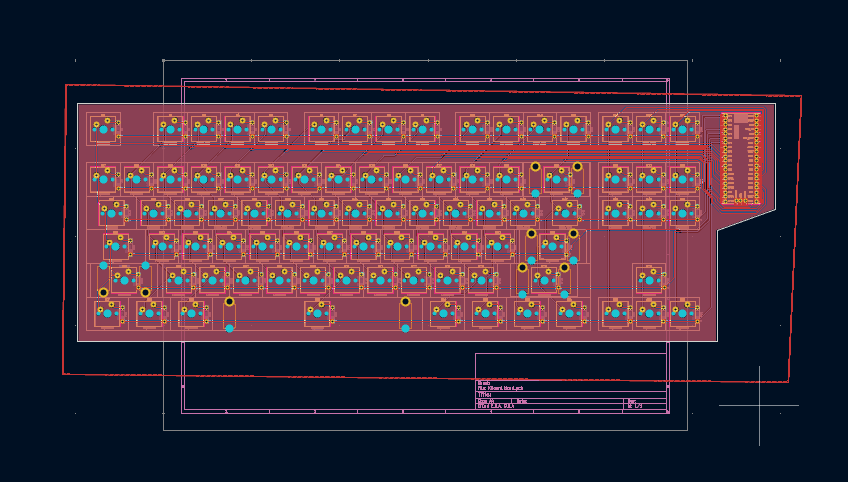

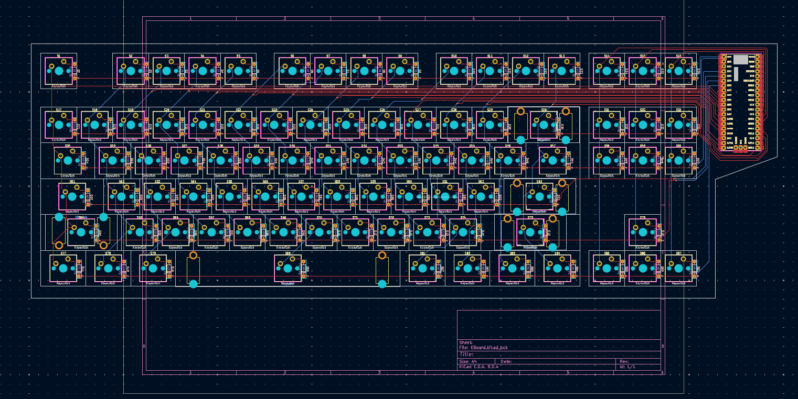

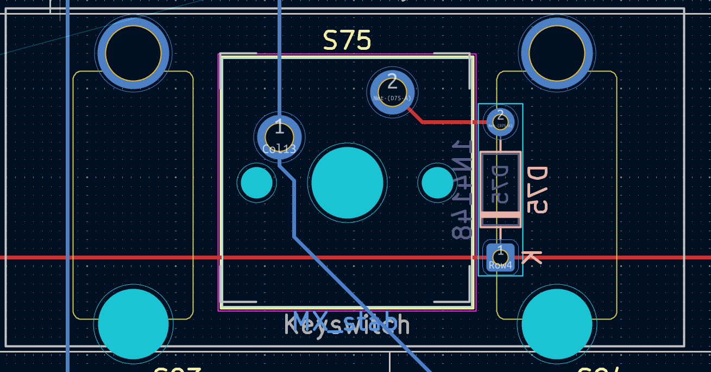

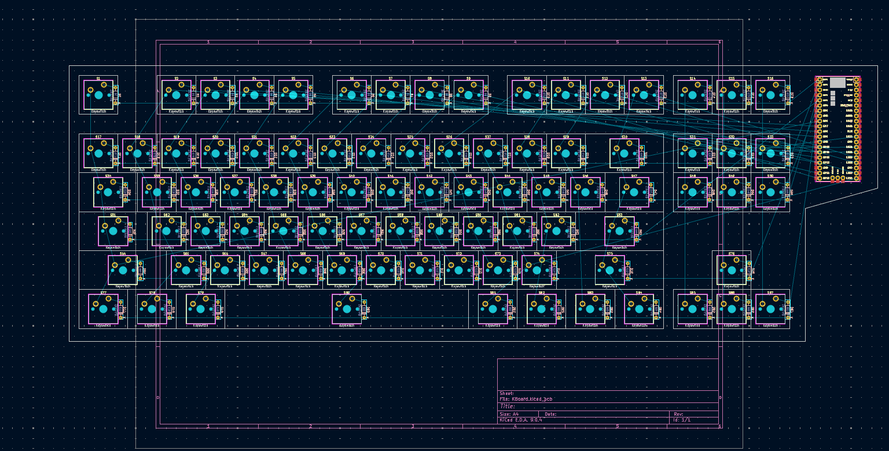

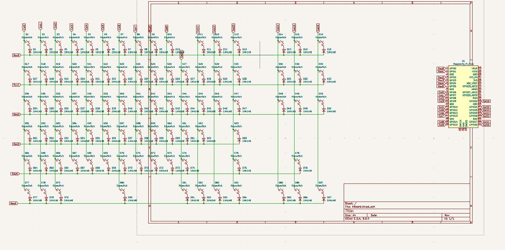

### Case 

The files for the case and plate are available in the CAD folder and in the Production folder..

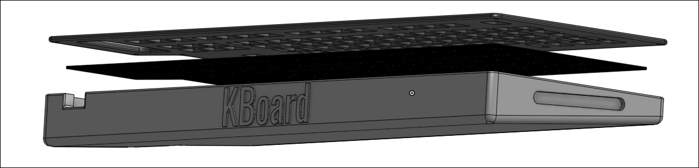

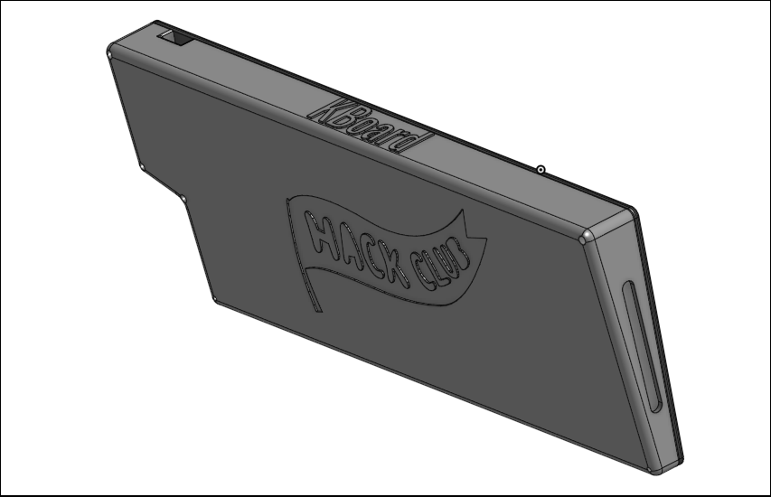

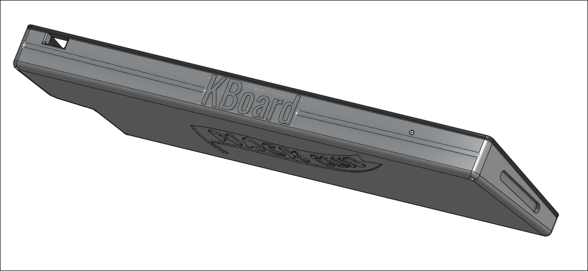

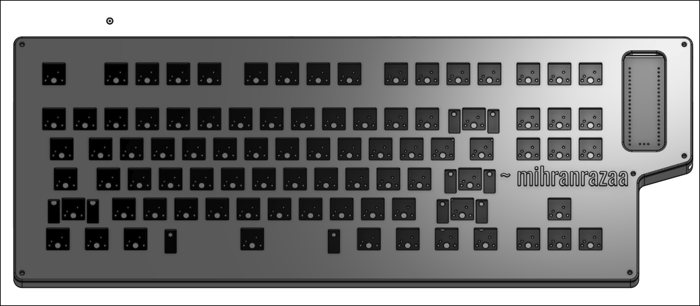

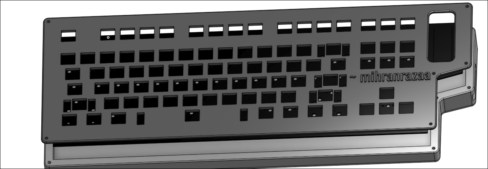

---

---

## BOM

| Component                 | Quantity | Note                                                                                    | Price    | Link                                                                                                                                       |
| ------------------------- | -------- | --------------------------------------------------------------------------------------- | -------- | ------------------------------------------------------------------------------------------------------------------------------------------ |
| Akko Yello creamy | 2       | Found a good website!! | 25USD    | [Available](https://stackskb.com/store/akko-v5-creamy-yellow-pro-switch-pack-of-45/)                                                    |
| Grey Keycaps set         | 1        | Good Asthetics are important I will keep the body grey :)                               | 16USD    | [Available](https://stackskb.com/store/white-grey-and-yellow-double-shot-abs-cherry-profile-keycaps/) |
| Stabilizer set            | 1        | PCB Mounted Stabs| 17USD    | [Available](https://stackskb.com/store/durock-smokey-screw-in-stabilizers-v2/)                                                         |
| Case & PCB                | 1        | This is the cheapest i could find                                             | 63USD | https://robu.in/                                                                                                                                         |
| TOTAL                     |          |                                                                                         | 110-120 |                                                                                                                                            |

---

made with <3 by [mihranrazaa](https://mihranrazaa.info/)

BYEEE
